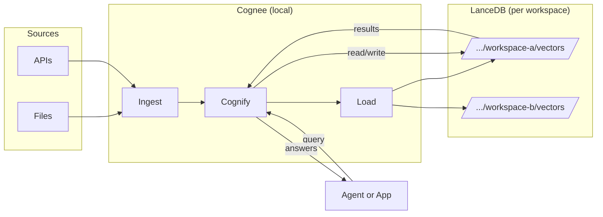
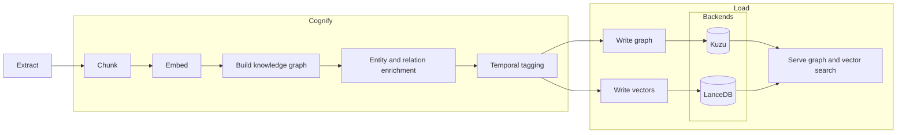
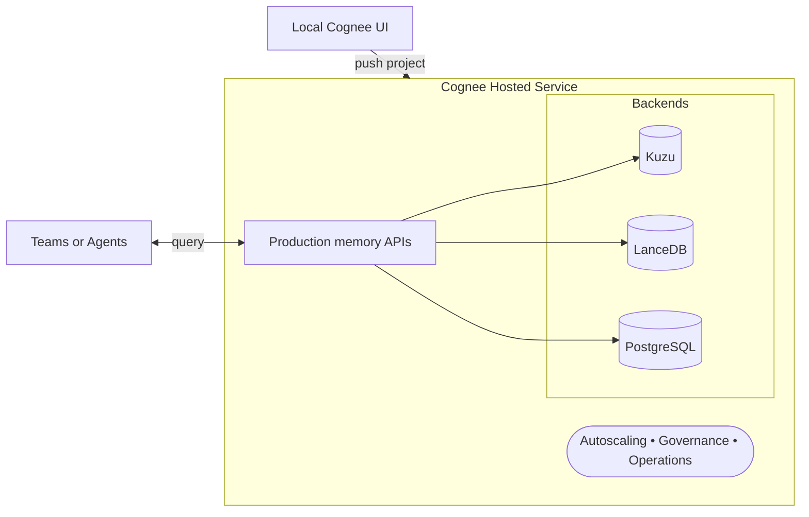

## Company Overview

[Cognee](https://cognee.com) helps agents retrieve, reason, and remember with context that has structure and time. It ingests sources such as files, APIs, and databases, then [chunks and embeds content](https://docs.cognee.ai/), enriches entities and relations, and builds a [knowledge graph](https://docs.cognee.ai/). 

Applications built on [Cognee](https://cognee.com) query both the graph and the vectors to answer multi-step questions with clearer provenance. This platform is designed for teams building autonomous agents, copilots, and search in knowledge-heavy domains.

**Figure 1:** Query and transform your LLM context anywhere using cognee's memory engine. 


*The Cognee interface enables developers to build and query AI memory systems with both graph and vector search capabilities.*

## The Challenge

Agent teams often struggle with stateless context and homegrown RAG stacks. They juggle a graph here, a vector store there, and ad hoc rules in between. This raises reliability risks and slows iteration. [Cognee](https://cognee.com) needed a vector store that matched its isolation model, supported per-workspace development, and stayed simple for day-to-day work.

### The Isolation Problem

Cognee's isolation model is the way it separates memory stores so that every developer, user, or test instance gets its own fully independent workspace. Instead of sharing a single vector database or graph across contexts, Cognee spins up a dedicated set of backends—most notably a [LanceDB store](https://lancedb.com/docs/)—for each workspace.

This approach solves a critical problem in AI development: when multiple developers work on the same project, or when running tests in parallel, shared state can lead to unpredictable behavior, data corruption, and debugging nightmares. Traditional vector databases require complex orchestration to achieve this level of isolation.

## LanceDB as a Solution

[Cognee](https://cognee.com) chose [LanceDB](https://lancedb.com) because it fits the way engineers actually build and test memory systems. Since [LanceDB](https://lancedb.com) is [file based](https://lancedb.com/docs/overview/), [Cognee](https://cognee.com) can spin up a separate store per test, per user, and per workspace. 

### Why File-Based Storage Matters

Developers run experiments in parallel without shared state, and they avoid the overhead of managing a separate vector database service for every sandbox. This approach shortens pull-request cycles, improves demo reliability, and makes multi-tenant development more predictable.

Unlike traditional vector databases that require running servers, [LanceDB's file-based approach](https://lancedb.com/docs/overview/) means each workspace gets its own directory on disk. This eliminates the complexity of managing database connections, ports, and service dependencies during development and testing.


[LanceDB](https://lancedb.com) stores original data and embeddings together through the [Lance columnar format](https://lancedb.com/docs/overview/lance/). Pipelines become simpler because there is no extra glue code to keep payloads and vectors consistent.


## How the Pieces Fit

[Cognee](https://cognee.com) delivers a durable memory layer for AI agents by unifying a knowledge graph with high-performance vector search. It ingests files, APIs, and databases, then applies an [Extract–Cognify–Load model](https://docs.cognee.ai/) to chunk content, enrich entities and relationships, add temporal context, and write both graph structures and embeddings for retrieval.

[LanceDB](https://lancedb.com) is the default vector database in this stack, which keeps embeddings and payloads close to each other and removes extra orchestration. Because [LanceDB](https://lancedb.com) is [file based](https://lancedb.com/docs/overview/), [Cognee](https://cognee.com) can provision a clean store per user, per workspace, and per test, so teams iterate quickly without shared state or heavy infrastructure.

### From Development to Production

This architecture scales from a laptop to production without changing the mental model. Developers start locally with [Cognee](https://cognee.com)'s UI, build and query memory against [LanceDB](https://lancedb.com), and validate behavior with isolated sandboxes.


*The Cognee architecture shows how data flows from sources through the ECL pipeline to both graph and vector storage backends.*

When it is time to go live, the same project can move to Cognee's hosted service, which manages [Kuzu](https://kuzudb.com) for graph, [LanceDB](https://lancedb.com) for vectors, and [PostgreSQL](https://postgresql.org) for metadata, adding governance and autoscaling as needed. [Cognee](https://cognee.com)'s Memify pipeline keeps memory fresh after deployment by cleaning stale nodes, strengthening associations, and reweighting important facts, which improves retrieval quality without full rebuilds.

The result is a simpler and more reliable path to agent memory than piecing together separate document stores, vector databases, and graph engines.

### Local Development Workflow

This diagram shows sources flowing into [Cognee](https://cognee.com) on a developer's machine, with each workspace writing to its own [LanceDB](https://lancedb.com) store. The benefit is clean isolation: tests and demos never collide, sandboxes are easy to create and discard, and engineers iterate faster without running a separate vector database service.

Each workspace operates independently, with its own:
- Vector embeddings stored in [LanceDB](https://lancedb.com/docs/storage/)
- Knowledge graph structure
- Metadata and temporal context
- Query and retrieval capabilities

**Figure 2:** Local-first memory with per-workspace isolation


### User Interface

The Cognee Local interface provides a workspace for building and exploring AI memory directly on a developer's machine. 

From the sidebar, users can connect to local or cloud instances, manage datasets, and organize work into notebooks. Each notebook offers an interactive environment for running code, querying data, and visualizing results. 


*The Cognee Local UI provides an intuitive interface for building and querying AI memory systems with both graph and vector search capabilities.*

The UI supports importing data from multiple sources, executing searches with graph or vector retrieval, and inspecting both natural-language answers and reasoning graphs. It is designed to make experimentation straightforward—users can ingest data, build structured memory, test retrieval strategies, and see how the system interprets and connects entities, all within a single environment. This local-first approach makes it easy to prototype, debug, and validate memory pipelines before moving them to a hosted service.

### Memory Processing Pipeline

[Cognee](https://cognee.com) converts unstructured and structured inputs into an evolving knowledge graph, then couples it with embeddings for retrieval. The result is a memory that improves over time and supports graph-aware reasoning.

This pipeline processes data through three distinct phases:
1. **Extract**: Pull data from various sources (files, APIs, databases)
2. **Cognify**: Transform raw data into structured knowledge with embeddings
3. **Load**: Store both graph and vector data for efficient retrieval

**Figure 2: Cognee memory pipeline**



Here the Extract, Cognify, and Load stages turn raw inputs into a [knowledge graph](https://en.wikipedia.org/wiki/Knowledge_graph) and embeddings, then serve both graph and vector search from [Kuzu](https://kuzudb.com) and [LanceDB](https://lancedb.com). Users gain higher quality retrieval with provenance and time context, simpler pipelines because payloads and vectors stay aligned, and quicker updates as memory evolves.

### Production Deployment Path

Teams begin locally and promote the same model to Cognee's hosted service when production requirements such as scale and governance come into play. This seamless transition is possible because the same data structures and APIs work in both local and hosted environments.

Learn more about [LanceDB](https://lancedb.com) and explore [Cognee](https://cognee.com).

**Figure 3: Hosted path with Cognee's production service**


This figure shows a smooth promotion from the local UI to Cognee's hosted service, which manages [Kuzu](https://kuzudb.com), [LanceDB](https://lancedb.com), and [PostgreSQL](https://postgresql.org) behind production APIs. Teams keep the same model while adding autoscaling, governance, and operational controls, so moving from prototype to production is low risk and does not require a redesign.

## Why LanceDB fit

[LanceDB](https://lancedb.com) aligns with [Cognee](https://cognee.com)'s isolation model. Every test and every user workspace can have a clean database that is trivial to create and remove. This reduces CI friction, keeps parallel runs safe, and makes onboarding faster. When teams do need more control, [LanceDB](https://lancedb.com) provides modern indexing options such as [IVF-PQ](https://lancedb.com/docs/search/vector-search/) and [HNSW-style graphs](https://lancedb.com/docs/search/vector-search/), which let engineers tune recall, latency, and footprint for different workloads.

### Technical Advantages

Beyond isolation, [LanceDB](https://lancedb.com) offers several technical advantages that make it ideal for Cognee's use case:

- **Unified Storage**: Original data and embeddings stored together eliminate synchronization issues
- **Zero-Copy Evolution**: Schema changes don't require data duplication
- **Hybrid Search**: Native support for both [vector search](https://lancedb.com/docs/search/vector-search/) and full-text search
- **Performance**: Optimized for both interactive queries and batch processing
- **Deployment Flexibility**: Works locally, in containers, or in cloud environments


Treat index selection as a product decision. Start with defaults to validate behavior, then profile and adjust the index and quantization settings to meet your target cost and latency.


## Results

These results show that the joint Cognee–LanceDB approach is not just an internal efficiency gain but a direct advantage for end users. Developers get faster iteration and clearer insights during prototyping, while decision makers gain confidence that the memory layer will scale with governance and operational controls when moved to production. This combination reduces both time-to-market and long-term maintenance costs.

### Development Velocity Improvements

> "LanceDB gives us effortless, truly isolated vector stores per user and per test, which keeps our memory engine simple to operate and fast to iterate." </br> - Vasilije Markovic, Cognee CEO

Using LanceDB has accelerated Cognee's development cycle and improved reliability. File-based isolation allows each test, workspace, or demo to run on its own vector store, enabling faster CI, cleaner multi-tenant setups, and more predictable performance. Onboarding is simpler since developers can start locally without provisioning extra infrastructure.

### Product Quality Gains

At the product level, combining Cognee's knowledge graph with [LanceDB's vector search](https://lancedb.com/docs/search/vector-search/) has improved retrieval accuracy, particularly on multi-hop reasoning tasks like [HotPotQA](https://hotpotqa.github.io). The Memify pipeline further boosts relevance by refreshing memory without full rebuilds. Most importantly, the same local setup can scale seamlessly to Cognee's hosted service, giving teams a direct path from prototype to production without redesign.

Key benefits include:
- **Faster development cycles** due to isolated workspaces
- **Reduced environment setup time** with file-based storage
- **Improved multi-hop reasoning accuracy** with graph-aware retrieval
- **Seamless deployments** when scaling to production

## Recent product releases at Cognee

[Cognee](https://cognee.com) has shipped a focused set of updates that make the memory layer smarter and easier to operate. A new local UI streamlines onboarding. The [Memify](https://cognee.com) post-processing pipeline keeps the [knowledge graph](https://en.wikipedia.org/wiki/Knowledge_graph) fresh by cleaning stale nodes, adding associations, and reweighting important memories without a full rebuild.

### Memify Pipeline in Action

The Memify pipeline represents a significant advancement in AI memory management, enabling continuous improvement without costly rebuilds. 

Here is a typical example of the [Memify pipeline](https://docs.cognee.ai/) for post-processing knowledge graphs:

```python
import asyncio
import cognee
from cognee import SearchType

async def main():
    # 1) Add two short chats and build a graph
    await cognee.add([
        "We follow PEP8. Add type hints and docstrings.",
        "Releases should not be on Friday. Susan must review PRs.",
    ], dataset_name="rules_demo")
    await cognee.cognify(datasets=["rules_demo"])  # builds graph

    # 2) Enrich the graph (uses default memify tasks)
    await cognee.memify(dataset="rules_demo")

    # 3) Query the new coding rules
    rules = await cognee.search(
        query_type=SearchType.CODING_RULES,
        query_text="List coding rules",
        node_name=["coding_agent_rules"],
    )
    print("Rules:", rules)

asyncio.run(main())
```

Self-improving memory logic and time awareness help agents ground responses in what has changed and what still matters. A private preview of [graph embeddings](https://en.wikipedia.org/wiki/Graph_embedding) explores tighter coupling between structure and retrieval. [Cognee](https://cognee.com) also reports strong results on graph-aware evaluation, including high correctness on multi-hop tasks such as [HotPotQA](https://hotpotqa.github.io). Cognee's hosted service opens this experience to teams that want managed backends from day one.

### What's Next

Looking ahead, Cognee is focusing on:
- Enhanced graph embedding capabilities for better structure-retrieval coupling
- Improved time-aware reasoning for dynamic knowledge updates
- Expanded integration options for enterprise workflows
- Advanced analytics and monitoring for production deployments


[Cognee](https://cognee.com) follows an ECL model: Extract data, Cognify into graphs and embeddings, and Load into graph and vector backends. The model maps cleanly to [LanceDB](https://lancedb.com)'s unified storage and indexing.


## Why this joint solution is better

Many stacks bolt a vector database to an unrelated document store and a separate graph system. That adds orchestration cost and creates brittle context. By storing payloads and embeddings together, [LanceDB](https://lancedb.com) reduces integration points and improves locality. [Cognee](https://cognee.com) builds on this to deliver graph-aware retrieval that performs well on multi-step tasks, while the Memify pipeline improves memory quality after deployment rather than forcing rebuilds. The combination yields higher answer quality with less operational churn, and it does so with a simple path from a laptop to a governed production environment.

### The Integration Advantage

Traditional approaches require complex orchestration between multiple systems:
- Vector database for similarity search
- Graph database for relationships
- Document store for original content
- Custom glue code to keep everything synchronized

Cognee + LanceDB eliminates this complexity by providing a unified platform that handles all these concerns natively.


Do not treat memory as a thin [RAG layer](https://en.wikipedia.org/wiki/Retrieval-augmented_generation). [Cognee](https://cognee.com)'s structured graph, time awareness, and post-processing combine with [LanceDB](https://lancedb.com)'s tuned retrieval to create durable and auditable context for agents.


### Getting Started is Simple

Developers can start local, install [Cognee](https://cognee.com), and build a memory over files and APIs in minutes. [LanceDB](https://lancedb.com) persists embeddings next to the data, so indexing and queries remain fast. When the prototype is ready, they can push to Cognee's hosted service and inherit managed [Kuzu](https://kuzudb.com), [LanceDB](https://lancedb.com), and [PostgreSQL](https://postgresql.org) without changing how they think about the system. Technical decision makers get a simpler architecture, a clear upgrade path, and governance features when needed.

### The Business Case

For organizations, this means:
- **Faster time-to-market**: No complex infrastructure setup required
- **Lower operational overhead**: Unified platform reduces maintenance burden
- **Better developer experience**: Local development matches production environment
- **Reduced vendor lock-in**: Open source components provide flexibility
- **Scalable architecture**: Grows from prototype to enterprise without redesign

## Getting started

1. Install [Cognee](https://cognee.com), build a small memory with the local [LanceDB](https://lancedb.com) store, and enable [Memify](https://cognee.com) to see how post-processing improves relevance. 
2. When production [SLAs](https://en.wikipedia.org/wiki/Service-level_agreement) and compliance become priorities, promote the same setup to Cognee's hosted service and gain managed scale and operations.

### Next Steps

Ready to build AI memory systems that scale? Start with the [Cognee documentation](https://docs.cognee.ai) and explore how [LanceDB](https://lancedb.com) can power your next AI application. The combination of local development simplicity and production scalability makes this stack ideal for teams building the future of AI.


[Cognee](https://cognee.com)'s local [MCP pattern](https://modelcontextprotocol.io) keeps data on the machine and uses [LanceDB](https://lancedb.com) and [Kuzu](https://kuzudb.com) under the hood. This approach is a strong fit for teams with strict data boundaries.


