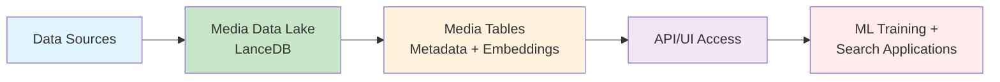
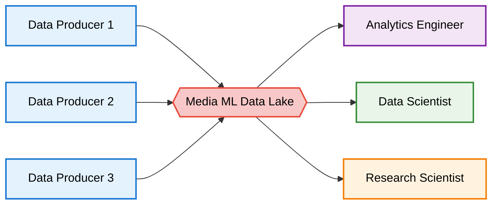

Hollywood may run on storytelling, but behind every frame of a Netflix production lies another narrative written in data. 

Every scene, audio track, subtitle, and script fragment is not just creative output. It is raw material for the next generation of machine learning. Petabytes of multimodal assets are spread across formats and workflows. Each one must be discoverable, queryable, and ready for research, training, and production.


To meet this challenge, Netflix has introduced [Media ML Data Engineering](https://netflixtechblog.com/from-facts-metrics-to-media-machine-learning-evolving-the-data-engineering-function-at-netflix-6dcc91058d8d) and built the **Media Data Lake**. This is a new specialization at Netflix that bridges the gap between traditional data engineering and the unique demands of media-centric machine learning.


The system unifies media assets, enriches them with metadata and embeddings, and serves them seamlessly into machine learning pipelines. 

At the core of the platform sits [LanceDB and the Multimodal Lakehouse](/blog/multimodal-lakehouse/).


## From Metrics Tables to Media Tables

Traditional pipelines were good at producing structured tables for metrics. Media data demands more. It is multimodal, unstructured, and deeply entangled with creative workflows. A single title may yield millions of frames, hours of multichannel audio, captions, embeddings, and annotations.

> The nature of media data is fundamentally different. It is multi-modal, it contains derived fields from media, it is unstructured and massive in scale, and it is deeply intertwined with creative workflows and business asset lineage. </br> — Dao Mi and the Media ML Data Engineering team, Netflix Tech Blog

The Media Data Lake organizes this into **Media Tables**. These are structured but flexible datasets that contain both canonical metadata and the outputs of advanced machine learning models. [With Lance as the underlying format](/docs/overview/lance/), Netflix can [evolve schemas](/docs/tables/schema/) without costly rewrites. It can index embeddings alongside raw blobs. And it can query petabytes of content with low-latency, high-concurrency performance proven in production.

**Figure 1:** A sample media table used by the [Netflix Engineering Team](https://netflixtechblog.com/from-facts-metrics-to-media-machine-learning-evolving-the-data-engineering-function-at-netflix-6dcc91058d8d)


## Architecture in Motion

The architecture combines real-time and offline processing. Lightweight queries expose raw assets and derived features for exploration. A **distributed inference layer** executes [GPU-powered batch jobs over entire libraries](/docs/geneva/jobs/). A **pythonic API** provides programmatic access to the Media Tables. Visual interfaces allow interactive browsing of assets. This dual design enables both fast experimentation and reliable productionization. Traditional data lakes and warehouses were never built to support this balance.

**Figure 2:** Conceptual architecture of a Media Data Lake


Figure 2 shows how Media Tables unify raw media, derived features, and machine learning outputs under one schema. This integration eliminates silos between creative assets and ML workflows, allowing researchers to query, explore, and train models on the same foundation. Built on LanceDB, it ensures that both interactive exploration and large-scale training run from a single source of truth.

## Media Data Lake vs. Traditional Data Lakes

The table contrasts traditional data lakes with the Media Data Lake. Traditional systems handle structured data well but struggle with multimodal assets, schema evolution, and hybrid querying.

| Feature | Traditional Data Lake | Media Data Lake (Netflix \+ LanceDB) |
| ----- | ----- | ----- |
| Data Types | Structured tables (text, numeric) | Multimodal (video, audio, images, text, embeddings) |
| Schema | Rigid, costly to evolve | Zero-copy data evolution |
| Query | SQL only | SQL, vector search, full-text search |
| Workload | Batch analytics | Real-time queries and GPU batch processing|
| Users | Analysts, BI teams | Machine learning engineers, researchers, creative ops |

## Where the Multimodal Lakehouse Shines

[The Multimodal Lakehouse](/blog/multimodal-lakehouse/) is built on LanceDB and the Lance format. It treats [unstructured blobs](/docs/storage/) as first-class citizens with uncompromised [random access I/O](/docs/overview/lance/). This is critical for shuffling and filtering media efficiently during training. [Zero-copy schema evolution](/docs/tables/schema/) means new features and annotations can be added without duplicating petabytes of data.

Hybrid querying combines [vector search](/docs/search/vector-search/), [full-text search](/docs/search/full-text-search/), and [SQL](/docs/search/sql-queries/) over the same table. This enables workflows like retrieving shots by visual similarity, filtering by dialogue, and joining against structured metadata. All of this happens in one unified system.

> With LanceDB, blobs and embeddings are not afterthoughts. They are core building blocks in the data model.

On the compute side, [declarative Python UDFs](/docs/geneva/udfs/) allow engineers to define feature extraction jobs that scale across hundreds of thousands of CPU cores and GPU slots. 

This UDF will create an embeddings column directly from a text column. It uses a preloaded model to batch-encode sentences into fixed-length 384-dimensional vectors. 

```python
from geneva import udf
@udf(schema=pa.list_(pa.float32(), list_size=384))
def embed_text(text: pa.Array) -> pa.Array: # batched udf
    MODEL = load_model() 
    sentences = text.to_pylist()
    embeddings = MODEL.encode(sentences, show_progress_bar=False)

    return pa.array(embeddings.tolist(), type=pa.list_(pa.float32(), list_size=384))
```

Features can be computed incrementally with checkpointing and preemption. Expensive GPU inference runs can pause and resume without wasted cycles. [The system supports billions of vectors indexed in hours and tens of petabytes](/docs/enterprise/) managed under a single abstraction. 


This performance has been proven in production by AI leaders such as ByteDance, MidJourney, and now Netflix.


## AI Workflows Reimagined

Training pipelines also benefit directly. The Multimodal Lakehouse integrates with [PyTorch and JAX loaders](https://lancedb.github.io/lance/integrations/pytorch/). Models can train on named SQL views over raw assets and features, with direct access to blob data through efficient APIs. [A distributed cache fleet delivers more than five million IOPS from NVMe SSDs.](/docs/enterprise/architecture/) It reduces cloud storage costs while sustaining more than twenty thousand QPS of vector search traffic. This allows Netflix to experiment with large multimodal models while maintaining production-grade cost efficiency.

> One of the most exciting developments is the rise of media tables, structured datasets that not only capture traditional metadata, but also include the outputs of advanced ML models. — Netflix Tech Blog

This revolution is about transforming media into structured, queryable, reusable fuel for the next generation of machine learning. That fuel can power HDR remastering, localization quality metrics, narrative understanding, multimodal search, and future applications that have not yet been imagined.

## A New Level of Collaboration

By anchoring its Media Data Lake on LanceDB, Netflix has created one of the first large-scale demonstrations of [the Multimodal Lakehouse vision](/blog/multimodal-lakehouse/). 

With LanceDB, developers, data scientists, ML researchers, and product engineers can work together seamlessly on building intelligent applications. By abstracting away the complexity of vector storage, indexing, and retrieval, LanceDB ensures data solutions are not only fit for purpose but also easy to extend.

**Figure 3:** Teams can collaborate around the Multimodal Lakehouse as a source of truth



For Netflix, it means faster iteration cycles, richer insights into creative workflows, and new AI-powered capabilities at global scale. For the wider ecosystem, it signals the arrival of a new standard. One platform that unifies multimodal data, computation, and machine learning into a single, production-ready foundation.

## Learn More About LanceDB

The foundation that powers Netflix’s Media Data Lake is open source and available to everyone. [LanceDB](https://lancedb.com/) and the [Lance format](https://lancedb.github.io/lance/) bring the same capabilities to any team working with multimodal data. With fast random access, zero-copy data evolution, hybrid search, and scalable feature engineering, LanceDB is redefining what a data lake can do in the age of AI.


To learn more about the Multimodal Lakehouse, read our study [Why Multimodal Data Needs a Better Lakehouse?](/download/)


