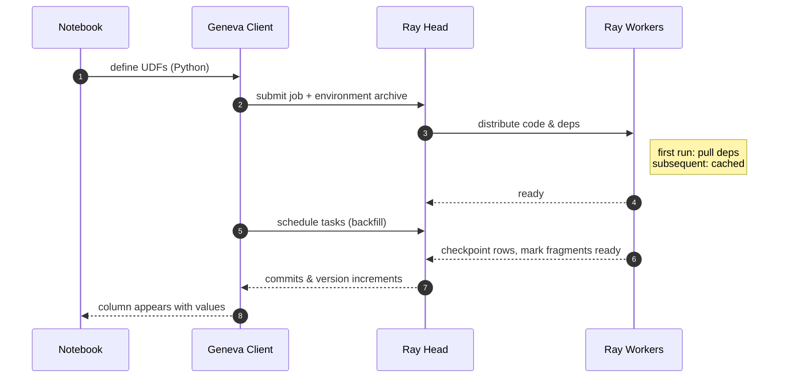
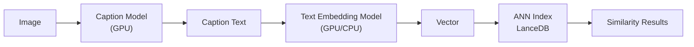
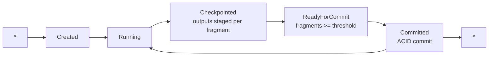
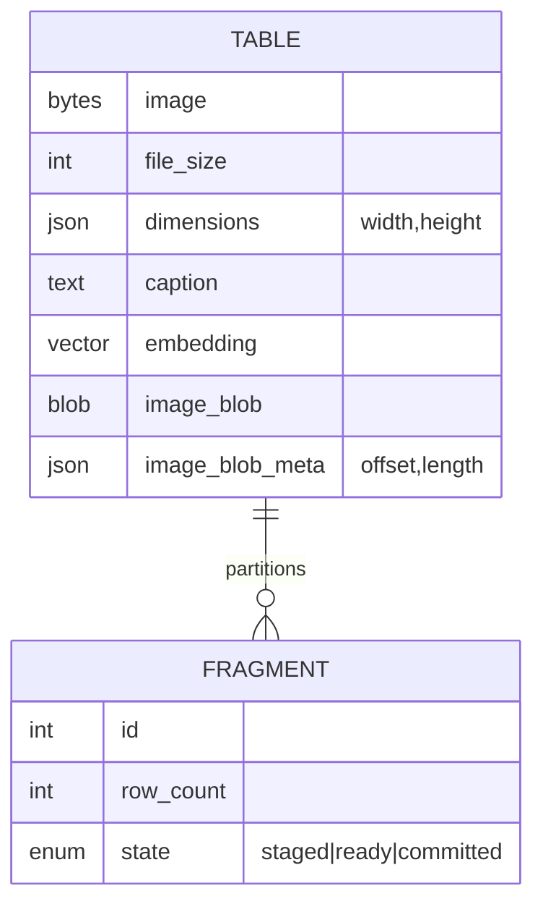

In this tutorial, you'll learn how to build a high-throughput feature engineering pipeline on top of LanceDB using Geneva. 

We'll work with the Oxford-IIIT Pets dataset (cats and dogs). We'll start with a single-column table of images. Then we'll expand it into something far richer. We'll add per-image file sizes, dimensions, captions generated by a GPU model, and dense vector embeddings suitable for similarity search. 



Geneva's basic promise is deceptively simple. Write Python like you normally would. Keep your functions pure. Geneva will serialize the code, ship the exact same environment to worker nodes, execute at scale, and persist results as new columns in LanceDB.


In this tutorial, we'll run four jobs in sequence (file size, dimensions, captions, embeddings), plus an asynchronous variant and a blob-column example, then close by tearing the cluster down cleanly.

Along the way, we'll cover the operational mechanics you'll care about in production. This includes dependency shipping to the cluster, first-run warm-up cost, fragment- and commit-level progress, backfills, and blob storage for large outputs.

### Watch the demo on YouTube

<div style="text-align: center;">
<iframe width="560" height="315" src="https://www.youtube.com/embed/4iKAOCw-_AA?si=pI98ifzKASgZ2vvT" title="YouTube video player" frameborder="0" allow="accelerometer; autoplay; clipboard-write; encrypted-media; gyroscope; picture-in-picture; web-share" referrerpolicy="strict-origin-when-cross-origin" allowfullscreen></iframe>
</div>

## Environment parity and first-run cost

### Setting up the Ray cluster

Before any data moves, the notebook triggers a Ray cluster. Geneva packages local dependencies and code, uploads them, and ensures the workers execute byte-for-byte the same code that you author locally. On the first run, you wait through a warm-up while the cluster starts and the environment archives land on the workers; this typically takes on the order of **\~2 minutes**. That latency is a feature, not a bug: once the system is warm, subsequent jobs reuse the cached environment and dispatch faster.

You can literally watch the cluster “come alive”: a head node spins up, worker nodes join, and only after the dependency phase completes does job execution begin. This is why we front-load the environment synchronization, then immediately follow with multiple jobs so later stages benefit from the warm cache.



## The base table and UDFs: file size and dimensions

The table begins life with a single image column. We then define two tiny UDFs: one that computes byte length (file size) and another that decodes the image to obtain width and height. There’s nothing special about these functions; they’re ordinary Python, wrapped as Geneva UDFs. The important part is how they execute and land in the table.

The first job (file size) demonstrates **progress semantics**. Geneva exposes three counters that reflect Lance’s internal mechanics:

* **rows checkpointed**: rows for which the UDF output has been computed and staged,  
* **rows ready for commit**: staged fragments that meet your commit criteria,  
* **rows committed**: rows that became visible in the table after a commit.

### How fragments and commits work

Under the hood, Lance partitions the dataset into **fragments**. Typically, you'll see roughly **\~25 rows per fragment**. A **commit granularity** knob lets you declare how many fragments must be ready before a commit fires (e.g., 5 fragments). That batching controls how frequently versions increment and when partial results become queryable. On the first heavy pass, you'll see the fragment counters and version numbers tick steadily upward; the file-size job typically completes in **\~3 minutes**.

The second job (dimensions) is identical from a systems perspective, only the function differs. With a warm cluster, this pass completes much faster — roughly **\~42 seconds** end-to-end — a pattern you should expect when CPU-bound transforms follow a GPU-free warm path.

A typical shape of code (illustrative):

```python
# define vanilla Python
def file_size(img_bytes: bytes) -> int:
    return len(img_bytes)

def dimensions(img_bytes: bytes) -> dict:
    from PIL import Image
    import io
    w, h = Image.open(io.BytesIO(img_bytes)).size
    return {"width": w, "height": h}

# register & add as computed columns
table = (table
  .add_column("file_size", udf(file_size)(col("image")))
  .add_column("dimensions", udf(dimensions)(col("image"))))

# backfill executes distributed over Ray; commits happen per fragment policy
table.backfill(["file_size", "dimensions"], commit_granularity=5)
```

## GPU inference: captions and embeddings

### Moving to GPU inference

The third job moves to GPU. A pretrained vision–language model (typically a Hugging Face model like BLIP) generates textual captions from raw pixels. Critically, the UDF uses a **setup** function and an **inner-loop guard** so that model weights load **once per worker**, not once per row. An asynchronous backfill submits the job and polls a **future** roughly every five seconds, showing the same checkpoint/ready/commit counters.

With the workers warm and the model cached, caption generation for the dataset typically completes in **\~39 seconds**. The fourth job generates **embeddings** (dense vectors) from the captions and writes them as a vector column. This typically completes very quickly, on the order of **single-digit seconds** — unsurprising if the embedding model is relatively light, the dataset small, and GPU hot.

### Key patterns for GPU workloads

Two patterns matter here:

1. heavy models belong in **setup()**, and  
2. UDFs can be **composed** (e.g., embed(caption(image))), with each stage materializing as its own column and versioned commit.

```python
# GPU-heavy UDF with setup() and guarded inner loop
@udf(setup=lambda: load_caption_model())
def caption(image, _ctx):
    model = _ctx.get("model")  # set by setup()
    if model is None:
        model = load_caption_model()           # guard on cold start
        _ctx["model"] = model
    return model.generate_caption(image)

@udf(setup=lambda: load_text_embedder())
def embed(text, _ctx):
    emb = _ctx.get("emb")
    if emb is None:
        emb = load_text_embedder()
        _ctx["emb"] = emb
    return emb.encode(text)

table = (table
  .add_column("caption", caption(col("image")))
  .add_column("embedding", embed(col("caption"))))

# async backfill; poll a future, observe checkpoint/commit metrics
fut = table.backfill_async(["caption", "embedding"], commit_granularity=5)
wait(fut)  # non-blocking poll
```

Once embeddings exist, we can perform **vector search**: push a Chihuahua image through the same embedding model to obtain a query vector, then query LanceDB for nearest neighbors in the embedding column. The point isn’t that this finds small dogs (it does), but that inference features become immediately useful because they’re *in* the table and benefit from Lance’s indexing, versions, and transactional commits.



## Asynchrony and concurrency

We can also run a portion of the pipeline **asynchronously and concurrently**. Two feature columns (file size and dimensions) are created empty and then backfilled in parallel, each with its own future. Because both UDFs are CPU-bound and the cluster is hot, one job completes in **\~5 seconds** while the other finishes shortly after. This variant demonstrates that Geneva’s execution model is a proper job system: you can launch, poll, and commit multiple feature backfills independently, and they’ll interleave on the worker pool.

```python
f1 = table.backfill_async(["file_size"], batch_size=..., commit_granularity=...)
f2 = table.backfill_async(["dimensions"], batch_size=..., commit_granularity=...)
wait_all([f1, f2])
```

```
gantt
  title Backfill concurrency (typical timing)
  dateFormat  mm:ss
  axisFormat  %M:%S
  section Cluster
  Warm-up           :active, 00:00, 02:00
  section Jobs
  File size (CPU)   :done,   02:00, 03:00
  Dimensions (CPU)  :done,   05:00, 00:42
  Captions (GPU)    :done,   05:50, 00:39
  Embeddings (GPU)  :done,   06:40, 00:06
```

*Durations here reflect the session’s order of magnitude; your numbers will vary with hardware, models, and batch sizes.*

## Fragments, checkpoints, and versioned commits

### The fragment/commit lifecycle

From a data-systems perspective, the most instructive portion is the fragment/commit lifecycle. Lance groups rows into **fragments**; **commits happen when a threshold number of fragments are ready**, making intermediate data **visible for reads** with each commit. You'll see three counters climb:

* rows **checkpointed** (UDF output staged),  
* rows **ready for commit** (fragments satisfy commit policy),  
* rows **committed** (visible and versioned).

Version numbers increment as commits succeed; early commits often batch fewer fragments, then stabilize as throughput evens out. This visibility model lets you run expensive, GPU-bound jobs yet still expose partial results; for exploratory workflows that tight feedback loop matters.



## Binary outputs with blob columns

The final step demonstrates **blob columns** for sizable binary artifacts. The code converts the image column into a Lance-encoded blob column, and writes a second column with blob metadata (offset/length). The API marks the encoding explicitly (e.g., “lance encoding blob true”), writes the job, and commits. This is a practical pattern when feature outputs are large (think masks, crops, serialized operator traces, or compressed tensors): store them as blobs, keep the metadata adjacent, and only materialize bytes when needed.

Conceptually:

```python
@udf
def to_blob(img_bytes: bytes) -> Blob:
    # choose an encoding; return (offset, length, data) per Lance blob protocol
    return encode_as_lance_blob(img_bytes)

@udf
def blob_meta(blob: Blob) -> dict:
    return {"offset": blob.offset, "length": blob.length}

table = (table
  .add_column("image_blob", to_blob(col("image")))
  .add_column("image_blob_meta", blob_meta(col("image_blob"))))
table.backfill(["image_blob", "image_blob_meta"])
```

## Putting it all together

By the end, the table evolves from a single raw image column into a multi-modal feature store: byte counts and dimensions for quick filters, captions for text-first analytics, embeddings for vector search, and blobs for heavyweight artifacts — all versioned, all committed in fragments, all produced via the same UDF/backfill abstraction. The cluster is then shut down, closing the loop neatly and ensuring no resources leak.



## Key takeaways

Keep your **setup()** heavy and your **inner loop** light; load models once per worker and reuse. Choose a **commit granularity** that balances visibility with metadata churn; for exploratory work, frequent small commits can be desirable. Treat **batch size** holistically with checkpoint cadence and fragment size — you want smooth, monotonic counters and predictable commit intervals. Use **async backfills** to overlap CPU- and GPU-bound work, especially after the initial 1–2 minute warm-up. When outputs are large or variably sized, prefer **blob columns** and store metadata explicitly.

## References 

* **LanceDB**: Lance columnar format, vector indexing, fragments, and versioned commits (core concepts behind progress counters and visibility).  
* **Ray**: distributed execution, head/worker topology, environment packaging, and task futures/polling.  
* **Oxford-IIIT Pet Dataset**: Parkhi et al., 2012 — the cat/dog corpus used here.  
* **Vision–Language Captioning**: BLIP/BLIP-2 families (Li et al., 2022; Li et al., 2023\) — typical caption models seen in demos of this style.  


