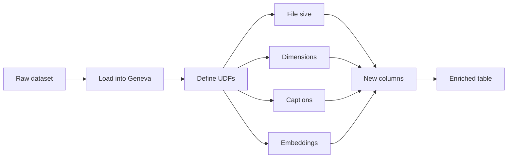
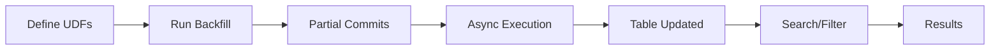

When you start a machine learning project, your first challenge usually isn’t training a model. It’s getting the data into a usable shape. 

> Raw data is messy: images are just pixels, audio is just waveforms, and text needs structure. Before you can do anything interesting, you need features. 

[LanceDB's Geneva](/docs/geneva/) is designed to take that pain away. Instead of writing ad hoc scripts that don’t scale, you define feature transformations once as Python functions, run them locally or on a distributed cluster, and Geneva materializes the results as typed, queryable columns.


[All the code in this tutorial is in our Python notebook.](https://githubtocolab.com/lancedb/blog-lancedb/blob/main/content/docs/tutorials/geneva/geneva-feature-engineering.ipynb) We ran this from Google Vertex AI, so you will have to setup your own machine.


In this walkthrough, you’ll load [a dataset of cats and dogs](https://www.robots.ox.ac.uk/~vgg/data/pets/), define four feature extractors, and run them at scale: file size, dimensions, captions with BLIP, and embeddings with OpenCLIP. Along the way, you’ll see how Geneva keeps the process consistent whether you’re running on your laptop or across a Ray cluster.

**Figure 1: The Feature Engineering Workflow**

This diagram shows how Geneva transforms raw data into enriched features through UDFs, creating new columns for file size, dimensions, captions, and embeddings.




Geneva's basic promise is deceptively simple. Write Python like you normally would. Keep your functions pure. Geneva will serialize the code, ship the exact same environment to worker nodes, execute at scale, and persist results as new columns in LanceDB.


## Watch the demo on YouTube

The demo is quite complex, so we recommend reading the article first.
The steps outlined in this blog will help guide you through the tutorial.

<div style="text-align: center;">
<iframe width="560" height="315" src="https://www.youtube.com/embed/4iKAOCw-_AA?si=pI98ifzKASgZ2vvT" title="YouTube video player" frameborder="0" allow="accelerometer; autoplay; clipboard-write; encrypted-media; gyroscope; picture-in-picture; web-share" referrerpolicy="strict-origin-when-cross-origin" allowfullscreen></iframe>
</div>

### Step 1: Install and check your environment

Start by installing the required packages. Geneva integrates with PyTorch, Hugging Face Transformers, and OpenCLIP, so you can use state-of-the-art models right out of the box.

```python
!pip install --upgrade datasets pillow
!pip install transformers==4.51 torch accelerate     # BLIP captioning
!pip install open-clip-torch scikit-learn matplotlib # CLIP embeddings
```

If you have access to a GPU, Geneva will take advantage of it automatically. It’s worth checking:

```python
import torch
print("CUDA available:", torch.cuda.is_available())
```

This matters because GPU acceleration can dramatically reduce the time it takes to generate captions and embeddings. If CUDA isn’t available, you can still run everything on CPU, which is fine for testing smaller datasets. The important thing is that the exact same code will work in either environment.

### Step 2: Load a dataset into Geneva

For this demo, we’ll use the [Oxford-IIIT Pets dataset](https://www.robots.ox.ac.uk/~vgg/data/pets/) — a collection of cats and dogs with labels. 


You can swap this for any dataset you like. You can ingest Arrow data into LanceDB tables, which makes it efficient to store, process, and query.

```python
from datasets import load_dataset
import pyarrow as pa
import io, shutil
from geneva.tqdm import tqdm

shutil.rmtree(GENEVA_DB_PATH, ignore_errors=True)

def load_images(frag_size: int = 25):
    dataset = load_dataset("timm/oxford-iiit-pet", split=f"train[:{NUM_IMAGES}]")
    batch = []
    for row in tqdm(dataset):
        buf = io.BytesIO()
        row["image"].save(buf, format="png")
        batch.append({"image": buf.getvalue(),
                      "label": row["label"],
                      "image_id": row["image_id"],
                      "label_cat_dog": row["label_cat_dog"]})
        if len(batch) >= frag_size:
            yield pa.RecordBatch.from_pylist(batch)
            batch = []
    if batch:
        yield pa.RecordBatch.from_pylist(batch)

db = geneva.connect(GENEVA_DB_PATH)
```

This function streams the dataset into batches instead of loading everything into memory at once. 

By breaking things into smaller batches, Geneva can process them in parallel more easily. If it was just one large partition, only one worker would take the work leaving the rest idle. By splitting into smaller batches, the batches can be farmed out to multiple workers for parallel processing. 

To make the table, just loop through the batches and add them:

```python
first = True
for batch in load_images():
    if first:
        tbl = db.create_table("images", batch, mode="overwrite")
        first = False
    else:
        tbl.add(batch)
```

At this point you’ve got a table of raw images with labels. It doesn’t do much on its own, but now you’re ready to enrich it with features.

### Step 3: Add simple features (file size, dimensions)

Start small. Geneva lets you define UDFs as simple Python functions, and the results become new columns in your table. The following examples show how to return both scalars and structured data:

```python
from geneva import udf
import pyarrow as pa
from PIL import Image
import io

@udf
def file_size(image: bytes) -> int:
    return len(image)

@udf(data_type=pa.struct([
    pa.field("width", pa.int32()),
    pa.field("height", pa.int32())
]))
def dimensions(image: bytes):
    img = Image.open(io.BytesIO(image))
    return {"width": img.size[0], "height": img.size[1]}
```

The first UDF calculates the size of each image file in bytes. It’s a trivial example, but it demonstrates how easy it is to add scalar values. The second UDF extracts the width and height of each image and returns them as a structured record. With these two functions, you now have queryable columns that let you filter images by resolution or spot outliers based on file size. Even though these examples are simple, they highlight Geneva’s flexibility in handling different data types.

### Step 4: Generate captions with BLIP

Now let’s create something more useful. Geneva makes it easy to run expensive models at scale by letting you write stateful UDFs. That means the model is loaded once and reused across rows, instead of being reloaded every time. Here’s how you can generate captions using BLIP:

```python
from transformers import BlipProcessor, BlipForConditionalGeneration
from PIL import Image
import torch, io

@udf(cuda=True)
class BlipCaptioner:
    def __init__(self): self.is_loaded = False
    def setup(self):
        self.processor = BlipProcessor.from_pretrained("Salesforce/blip-image-captioning-base")
        self.model = BlipForConditionalGeneration.from_pretrained("Salesforce/blip-image-captioning-base")
        self.device = torch.device("cuda" if torch.cuda.is_available() else "cpu")
        self.model.to(self.device); self.is_loaded = True
    def __call__(self, image: bytes) -> str:
        if not self.is_loaded: self.setup()
        raw = Image.open(io.BytesIO(image)).convert("RGB")
        inputs = self.processor([raw], return_tensors="pt")
        inputs = {k: v.to(self.device) for k,v in inputs.items()}
        out = self.model.generate(**inputs, max_length=50)
        return self.processor.decode(out[0], skip_special_tokens=True)
```

With this UDF, each image in your dataset now gets a natural language description. Instead of just having raw pixels and labels, you can run queries like “show me all the rows where the caption mentions a dog.” This transforms your dataset into something you can search and analyze in ways that weren’t possible before. And because the model is cached, it runs efficiently even across large batches.

### Step 5: Create embeddings with OpenCLIP

Captions give you text, but embeddings give you the ability to search semantically. With embeddings, you can ask questions like “find images most similar to this one” or “cluster my dataset into related groups.” Geneva makes it simple to generate these embeddings and store them as vector columns.

```python
import open_clip, numpy as np

@udf(data_type=pa.list_(pa.float32(), 512))
class GenEmbeddings:
    def __init__(self): self.is_loaded = False
    def setup(self):
        self.model, _, self.preprocess = open_clip.create_model_and_transforms(
            "ViT-B-32", pretrained="laion2b_s34b_b79k")
        self.is_loaded = True
    def __call__(self, image: bytes):
        if not self.is_loaded: self.setup()
        # preprocess → forward pass → normalize → return 512-d vector
```

Once you run this, every image will have a 512-dimensional vector representation. That vector becomes the foundation for building similarity search, recommendations, or clustering workflows. Instead of just relying on labels or captions, you now have a mathematical representation of content that Geneva can index and query.

**Figure 2: Backfill Execution and Querying**

This diagram shows Geneva's execution workflow: UDFs are processed in batches with partial commits, then results become available for searching and filtering.



### Step 6: Run backfills

Defining UDFs is only half the story — you need to run them against your dataset. Geneva’s backfill API applies your UDFs across the table and writes the results into new columns. For lightweight tasks like file size, you can run them synchronously:

```python
tbl.backfill("file_size", batch_size=10)
tbl.backfill("dimensions", batch_size=10, commit_granularity=5)
```

For heavier tasks like embeddings, you’ll want to run them asynchronously. This way, Geneva commits partial results as they’re processed, and you can monitor progress in real time:

```python
tbl.add_columns({"embedding": GenEmbeddings()})
fut = tbl.backfill_async("embedding", batch_size=10, commit_granularity=2)

while not fut.done(timeout=5):
    tbl.checkout_latest()
    done = tbl.search().where("embedding is not null").to_arrow()
    print(f"committed {len(done)} rows, version {tbl.version}")
```

This workflow makes a big difference when you scale. You don’t have to wait hours for the entire dataset to finish before you can see results. Geneva will stream partial results as they come in, and because every version of the table is saved, you can safely retry or roll back if something fails.

#### A quick “before and after” view

This is just a simple example of the evolution in data you should see:

```bash
| image_id | label | image (bytes) |
|----------|-------|---------------|
| pet_001  | cat   | ...           |
| pet_002  | dog   | ...           |
| pet_003  | cat   | ...           |
```

UDFs take effect, your table grows with feature columns:

```bash
| image_id | label | file_size | dimensions        | caption                           | embedding        |
|----------|-------|-----------|-------------------|-----------------------------------|------------------|
| pet_001  | cat   | 15423     | {"w":128,"h":128} | "a small brown cat sitting down"  | [0.12, 0.33,...] |
| pet_002  | dog   | 28764     | {"w":256,"h":256} | "a black dog looking at camera"   | [0.42, 0.77,...] |
| pet_003  | cat   | 19287     | {"w":128,"h":128} | "a fluffy white kitten indoors"   | [0.09, 0.55,...] |
```

*(These tables are illustrative to show the shape of the data; in the notebook you’ll see Arrow/Lance tables and DataFrame previews.)*

## Step 7: Query your results

Once your features are materialized, you can treat them just like any other database column. For example, you can run a SQL query to filter by captions:

```python
SELECT image_id, caption
FROM images
WHERE caption LIKE '%dog%'
```

Or you can query/filter for them in Python:

```
rows = tbl.search().where("caption is not null").to_arrow()
```

At this point, your dataset has evolved from a collection of raw images into a rich table with metadata, captions, and embeddings. You can search it, analyze it, or feed it into downstream pipelines without writing custom glue code.

## Why this workflow matters

What you’ve built here is more than just a demo. By combining UDFs with Geneva’s execution engine, you’ve taken raw data and turned it into something structured, searchable, and scalable. 

- Scalars like file size show you that you can store simple numbers. 
- Structs like dimensions let you work with richer metadata. 
- Captions give you natural language descriptions that make the dataset human-readable, while embeddings let you run semantic search and clustering. 

Because Geneva backfills work asynchronously and are versioned, you don’t have to worry about reruns or failures — you always know where you left off. 

And perhaps most importantly, you don’t have to change your code when you scale: the same functions you tested on a handful of images locally will run across millions of rows in a Ray cluster. That’s the difference between a quick prototype and a production-ready workflow.

## Your next step

1. Pick a dataset that matters to you. Maybe it’s product images from your company’s website, or a collection of documents you want to index. 

2. Start with a small batch locally to make sure your UDFs behave as expected. 

3. Then, when you’re ready, scale it out with a cluster. Geneva gives you a smooth path from experimentation to production, without the usual friction of rewriting pipelines for distributed systems. 

Once you’ve experienced how quickly you can go from raw pixels to searchable features, you’ll see why Geneva changes the way you approach feature engineering.


[All the code in this tutorial is in our Python notebook.](https://githubtocolab.com/lancedb/blog-lancedb/blob/main/content/docs/tutorials/geneva/geneva-feature-engineering.ipynb) We ran this from Google Vertex AI, so you will have to setup your own machine.

