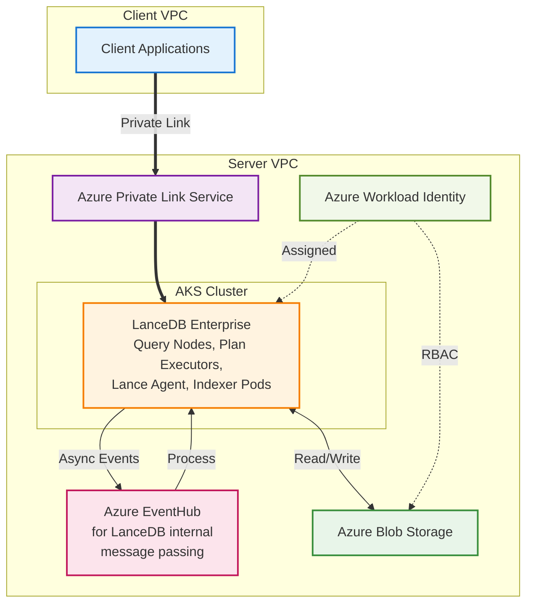
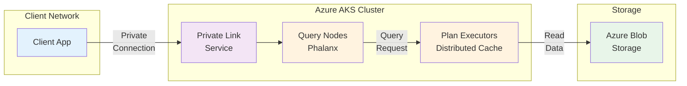
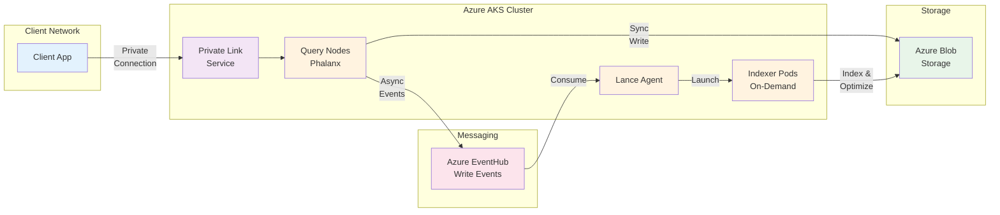
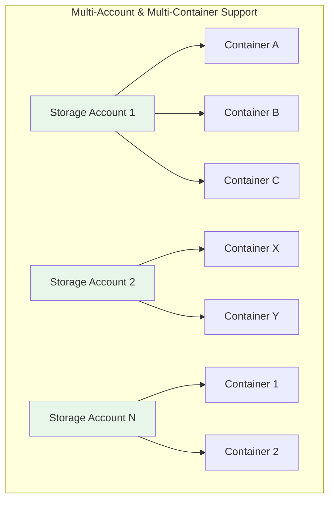

# Azure LanceDB Enterprise - Simplified Architecture

LanceDB Enterprise can be deployed on Azure using Azure Kubernetes Service (AKS) with Azure Blob Storage for data persistence and Azure Private Link for secure connectivity.

## General Architecture Overview

### Key Components

- **LanceDB architecture** is deployed in an AKS cluster within its own VPC
- **Client applications** connect to the cluster securely using Azure Private Link
- **AKS cluster** is granted Azure Blob Storage read/write permissions using Azure Workload Identity
- **Azure EventHub** can be used as the message queue by LanceDB Enterprise for internal message communication (alternative: self-hosted Kafka cluster in AKS)

## Read Path Architecture

### Read Path Flow

1. **Client Application** sends query request through Private Link
2. **Query Nodes** receive and process the request
3. **Plan Executors** optimize and execute the query
4. **Azure Blob Storage** provides data access with distributed caching

## Write Path Architecture

### Write Path Flow

Query nodes write data synchronously to Azure Blob Storage while asynchronously sending data modification events to Azure EventHub (or self-hosted Kafka cluster). These write events are processed by the Lance Agent, which launches indexing pods or data optimization pods to optimize data for better read performance.

## Deployment Options

### Storage Architecture Support

### Deployment Models

LanceDB Enterprise supports three deployment models on Azure:

#### 1. Fully Managed Service
- **Infrastructure and storage** in LanceDB's Azure account
- **Complete management** by LanceDB team
- **Simplest setup** for customers

#### 2. BYOC (Bring Your Own Cloud)
- **Infrastructure and storage** in customer's Azure account
- **Managed by LanceDB** or customer
- **Full control** over data residency

#### 3. Hybrid - Bring Your Own Container
- **Infrastructure** in LanceDB's account
- **Storage containers** in customer's account
- **Available on request** (not implemented yet but not hard to implement)


For private deployments, high performance at extreme scale, or if you have strict security requirements, [contact us about LanceDB Enterprise](mailto:contact@lancedb.com).
